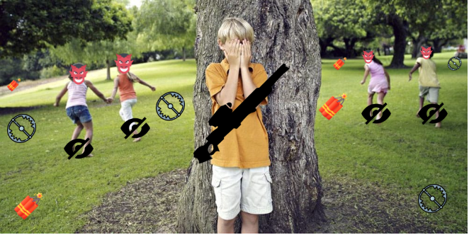

# Hide-and-Seek-Royale

This is a revolutionary Hide and Seek Battle Royale game! Be the seeker or a runner and hunt each and every of the players until there is only one standing!

Click [here](https://github.com/gamedev-srg/Hide-and-Seek-Royale/blob/main/formal-elements.md) for a detailed description of the game..

Click [Here](https://g-r-s.itch.io/hidenseek) for the itch.io page of the game.

## The game
### Recently Added:
* we recently added a Demo!
* added a main menu, and for each type of win/lose added a new widnow accordingly
### Roles:
* Hiders - All hiders have the same goal, to hide from the Hunter, and place traps for him, or fellow hiders. you do want to be the last one left after all.
* Hunter - These only one of you. your job is to find every last hider, but you need to be careful, as they can place traps in startegic locations to try and bring you down.

### Controls
The controls for this game are standard. 
* W to walk where you aim. 
* S to walk backwards.
* Left-Click or CTRL to fire.
* Shift+W to sprint.
* F to place traps.

### Powerups:
* In certain areas of the game you can find Powerups that enhance or restore your abillities. 
for example: The Floating Spear Powerup will replenish your Spear Trap stores. You can see if you have Spear Traps left on your character!

### Notes:
We have not implemented multiplayer or AI npc yet, so you can only play as the Hunter, and look for the npcs that are hiding across the map.
