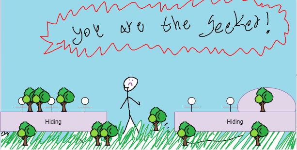
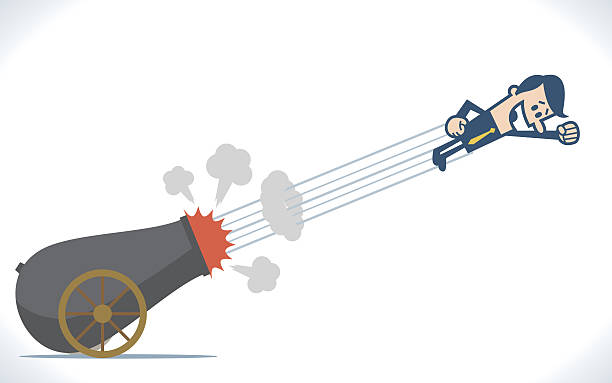
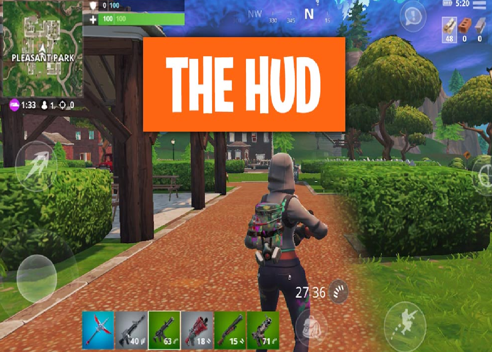

# Hide and Seek Royale

**The next generation Hide and Seek Battle Royale! Revenge of The Seeker**

## Game Character

Play the classic hide and seek with new extreme rules. In this game you can be either the seeker or be a runner and hide and run for your life.
Unlike the classic hide and seek this time the seeker and the other players need to hunt each other out and the last one to survive is the winner.

The game supports PC and Android with cross-play support.

---

## Main Components

המחישו את התשובות שלכם בעזרת ציורי-מסך.

### 1. Players

* The game is for payers aged 12 and above. Anyone who ever played hide and seek will understand the game very quickly and other than that the game does not require any other experience. 
* The game required a minimum of 4 players and can be played up to a maximum of 6
* The game is primarily and only a competitive game.

### 2. Targets

* The player need to be the last one standing after all of the other players are dead or caught in action. 
* For the first playtime each player can play the 5 minutes tutorial that will describe all the game mechanism and rules, because this is a very simple game there isn't much learning needed. During the first phase of the game there will be floating text that will tell the player his next goal. For example if you are the seeker the game will announce it to all of the players at the beginning. 
* The player cannot choose the game goals, those are chosen randomly and according to the games progress. 

### 3. Procedure

* Depending the role the player was given, for the first 30 second of the game the arena will unveil itself while the players will see the hiding places being build from the ground up, this process wil be very fast so everyone would have a glimpse of the arena they are going to play at. Than for the next seconds all of the players will be shot from a cannon to the arena and will have a fixed time that no one can attack or hunt any other to find a hiding place. The seeker in the meantime will be shot from the cannon to the center of the arena and will be able to slightly see the firs flight route of the other characters. 

    >**Controls**: While in mid air, the player can aim themselves using the mouse and WASD keys on the keyboard. The mouse will move the camera can the keystrokes will move the player to the desired direction. All of the above information will be taught in the games tutorial.
* The game core procedures are the "Hide and Hunt" principles in which all of the players need to hide from each other while the seeker is looking for them and try to lure each other out in order to hunt them. The seeker in the meanwhile needs just to hunt the other players while avoiding the traps of the other players. Each two minutes or each time a player is caught and killed the map will get smaller by a fixed size. While running over the map the players can find items like traps, weapons and more. Theses items will be used to defeat other players.

    >**Controls**: The player will move with the WASD keys while moving the camera with the mouse. Items can be picked up using the space key and switched with the mouse roller or the numpad. Using items is as easy as aiming with the mouse and left clicking to use the trap/weapon in hand. 
* After all of the other players are dead, the last player standing is the winner of this round. Each time there will be a message announcing the current phase accordingly. 

### 4. Rules

* For each of the two playable roles there are different rules:

    >Seeker: The seeker is the only one that does not need to hide and he cannot exit the map like the other players. 
    
    >Runner: The runner have to hide from the seeker and cannot exit the map. 

* The only rules that can affect the games outcomes is the basic survival rule, if you want to win, Survive!
* All the games rules will be learned during the games tutorial but the characters can also be warned while getting closer to the maps exit or after being spot by the seeker. 

### 5. Resources

 he is also the only one who starts the game with a long ranges weapon of his choice, a resource not available to other players. He cannot exit the map, exiting the map will kill any player.

* The game resources are traps like mines, bear traps and holes and long range weapons that can be used only by the seeker like a bow and arrow or a gun.
* The only purpose of the game resources is to kill the other players. 
* Resources can be found randomly withing the map, on the ground, on a tree or in a random house. 
* These will be a large map the the games start and the number of the special resources will be low, we will use a minimum distance algorithm to spread those few resources in the map so each character will find only one or two of them if he's lucky in his area. Another game mechanism that will make resource finding hard is that all of the characters can take all the resources, if someone finds it first he wil have it and after someone finds the resource it's gone from the map until the end of the current round. 
* The game will have a resource list floating on the loading screen and the character will be able to see his own resources on the games HUD while playing.

### 6. Conflicts

* The main game obstacles are the map itself that is getting smaller and smaller as the time passes. The other game obstacles are random traps that are hidden inside the game like bear traps that the player can either disarm and use if he sees the trap before walking over it or walk over it and die.
* The players will be in a constant conflict between one another, there is no cooperation here. Each player needs to kill the others to survive. 
* The dilemmas between each role is different:

> Seeker: The seeker's main dilemma is where to search and how. He may have the best weapon in the game but he needs to be aware of the map traps and the traps being set by the other players. 

> Runner: The runner's main dilemma is how to lay traps and kill the other players while keeping himself hidden from all of the other players. 

### 7. Limits

* The game world will be open inside the map borders. Means that players can choose where to go and what to do in each step but they cannot leave the maps borders or else they will die and lose the current round. 

> Borders:The game borders will be marked from the ground to the sky with a blue and red glowing border, there is no way the player will miss the border. Each time the border will get smaller there will be a message displayed and a special sounds prompting the players to look at the message. 

Each player will have a small floating map over the screen on his HUD that will marked where he is currently and where is the border. When the player moves, the marker on the minimap will move as well allowing the player to see his locationg and plan accordingly. 

### 8. Results

* The game has only one outcome, when one of the players is the winner. The rest will lose and will have to try again.
* The end result is almost purely dependent on play-style and experience. Even if the player will be lucky enough to find good weapons, if he is not skilled enough he will not use them correctly and waste them for nothing. 
* The game has a zero-sum outcome

---

## Market Research

> For this research we searched google, steam and google play store for the keywords "Hide and seek", "Hide and seek battle royale", "Hide and seek weapons", "Hide and seek game", "Hide and seek game map". and we chose the most famous games by player base or downloads

### 1. Minecraft: Hide and Seek Maps:
https://www.minecraftmaps.com/hide-and-seek-maps

Despite being one of the top games in the entire world the hide and seek maps of Minecraft are not a main game mechanism and are private add-ons people can download and play. Our game will be focused only in the hide and seek mechanism and will implement the battle royale features that are not available in Minecraft which is one of the biggest hypes in the recent years. 

### 2. Hide Online - Hunters vs Props
https://play.google.com/store/apps/details?id=com.hitrock.hideonline

This game is the closest game we found online that implements mechanisms that are similar to what we are planning. But in this game you can only hide and run as a prop and you cant really be active against other players while playing a prop. In our game even the runner and hiders will be able to hunt other players and because we implement a mechanism that makes all of the players active, everyone will be more aware that they can die at anytime! this will make the game more engaging with and keep the players playing. 

### 3. Hide 'N Seek!
https://play.google.com/store/apps/details?id=com.seenax.HideAndSeek

This is a more classic hide and seek game, this is the most famous game in the Android app store. As we mentioned above, our game will implement the battle royale features that will be much more engaging for players. The adrenaline our game will produce among the players will be higher and make them want to play more and more rounds until they win. The other important mechanism our game implements is competitive which is very attractive for everyone. 

Icons made by <a href="https://www.freepik.com" title="Freepik">Freepik</a> from <a href="https://www.flaticon.com/" title="Flaticon">www.flaticon.com</a>
